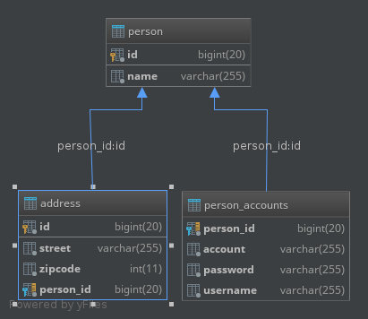

# Overview
This project is a sample that helps to showcase how Spring supports [Amazon Relational Database Service](https://aws.amazon.com/rds/).  Hibernate is the ORM that sits atop the Spring infrastructure managing the connection to RDS. 

# Guidebook
Details about this project are contained in the [guidebook](guidebook/guidebook.md) and should be considered mandatory reading prior to contributing to this project.

# Prerequisites
* [JDK 8](http://zulu.org/) installed and working
* a configured RDS instance (MySQL) named `sample` 

# Building
`./gradlew` will pull down any dependencies, compile the source and package everything up.

# Installation
Nothing to install.

# Tips and Tricks
## Starting The Server
Edit `application.yml`, inserting your API keys and RDS credentials, followed by `./gradlew bootRun`.

## Adding Data
The application supports `POST`ing to `/person/{name}` which inserts data into the database.  For example, `curl --silent --show-error --request POST localhost:8080/person/bob | python -m json.tool` gives you something like this:

```json
{
    "accounts": [
        {
            "account": "257B6A1F",
            "password": "7147D5F4",
            "username": "610400A9"
        },
        {
            "account": "173D3A70",
            "password": "1786057E",
            "username": "4775EBF"
        },
        {
            "account": "1F576B3D",
            "password": "1C592BE5",
            "username": "36ADE52A"
        },
        {
            "account": "2A2DA08",
            "password": "3DC25536",
            "username": "484A6F"
        }
    ],
    "addresses": [],
    "id": 3,
    "name": "bob"
}
```

## Reading Data
Hitting `curl --silent --show-error --request GET localhost:8080/person/1 | python -m json.tool` gets you

```json
{
    "accounts": [
        {
            "account": "1F5D0098",
            "password": "3A7F23E6",
            "username": "353E1EE"
        },
        {
            "account": "2A472C41",
            "password": "141FE44E",
            "username": "249D1BE9"
        },
        {
            "account": "54DAD73E",
            "password": "2532CFC6",
            "username": "54AC3750"
        },
        {
            "account": "31DF8B69",
            "password": "1A3076DC",
            "username": "162244B3"
        }
    ],
    "addresses": [
        {
            "id": 1,
            "street": "7287FDE9",
            "zipcode": 540788033
        },
        {
            "id": 2,
            "street": "5587F50A",
            "zipcode": 420590664
        }
    ],
    "id": 1,
    "name": "bob"
}
```
and `curl --silent --show-error --request GET localhost:8080/address/1 | python -m json.tool` gets you

```json
{
    "id": 1,
    "street": "7287FDE9",
    "zipcode": 540788033
}
```

Spring is configured to get data inside read-only transactions from replica sets but I have not found a way to prove that it is doing so.

# Automatic Failover
Spring is supposed to retry operations in the event of an instance failing, contacting a secondary instance in another availability zone.  I haven't figured out a way to test this behavior.  The documentation states that this behavior should be reserved for operations that are not time-sensitive, such as batch processing.  For that reason, I decided not to enable that feature.

# Database Schema
If you are interested in how Hibernate interpreted our modeling hints, this diagram should be of interest to you.



# Troubleshooting

# Contributing

# License and Credits
* This project is licensed under the [Apache License Version 2.0, January 2004](http://www.apache.org/licenses/).
* The guidebook structure was created by [Simon Brown](http://simonbrown.je/) as part of his work on the [C4 Architectural Model](https://c4model.com/).  His books can be [purchased from LeanPub](https://leanpub.com/b/software-architecture).
* Patrick Kua offered [his thoughts on a travel guide to a software system](https://www.safaribooksonline.com/library/view/oreilly-software-architecture/9781491985274/video315451.html) which has been [captured in this template](travel-guide/travel-guide.md).

# List of Changes
